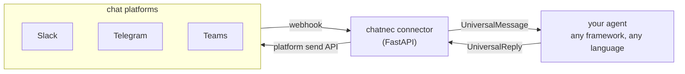

<p align="center">
  
</p>

<p align="center">
  One normalized message format. Adapters for Slack, Telegram, and Teams.<br>
  A single function signature so any agent — any framework, any language — can be wired up in a few lines.
</p>

<p align="center">
  
  
  
  
</p>

---

## Contents

- [Why](#why)
- [How it works](#how-it-works)
- [Demo](#demo)
- [Quickstart — Python, embedded](#quickstart--python-embedded)
- [Quickstart — any language, HTTP mode](#quickstart--any-language-http-mode)
- [Platform support](#platform-support)
- [Layout](#layout)
- [Adding a new platform](#adding-a-new-platform)
- [Tests](#tests)

## Why

Every chat platform has its own webhook shape, auth scheme, and reply API —
Slack signs requests with HMAC, Telegram uses a bot-API secret token, Teams
signs with a Bot Framework JWT you validate against a JWKS endpoint. An agent
that wants to run on all three either reimplements this three times or gets
coupled to one platform's SDK.

chatnec absorbs all of that behind one interface:

- **`UniversalMessage`** — what every adapter normalizes inbound events into.
- **`UniversalReply`** — what you send back; the right adapter delivers it.
- **`AgentHandler`** — the one function signature your agent needs to implement:
  `async (UniversalMessage) -> str | UniversalReply | None`.

## How it works



Two ways to plug an agent in:

| | Embedded | HTTP |
|---|---|---|
| Where it runs | Same process as the connector | Anywhere — any language, any host |
| Wiring | `create_app(handler=my_handler)` | `AGENT_MODE=http`, `AGENT_WEBHOOK_URL=...` |
| Contract | `async (UniversalMessage) -> str \| UniversalReply \| None` | POST body is `UniversalMessage` JSON, response is `{"text": "..."}` |
| Best for | Python agents, fastest setup | Node/Go/Java/etc. agents, or independent scaling |

The HTTP contract is deliberately the smallest possible surface, one JSON
request in and one JSON response out, so it never presupposes a framework.
The [TypeScript SDK](ts-sdk/) is a thin convenience wrapper around that same
contract for Node.

## Demo

[`docs/demo.md`](docs/demo.md) has a real captured terminal transcript of the
full webhook → agent → reply round trip running locally — including
per-conversation context persisting across turns — plus the test suite
passing. It uses a stand-in platform adapter so it's reproducible without
registering real bot credentials first; the code path exercised is identical
to the one the real Slack/Telegram/Teams adapters run.

## Quickstart — Python, embedded

```bash
cd python
pip install -e .
cp env.example .env   # fill in TELEGRAM_BOT_TOKEN and/or SLACK_*/TEAMS_*
```

```python
# any callable becomes a bot on every configured platform
from chatnec import create_app
from chatnec.integrations import from_function

def my_agent(text: str) -> str:
    return f"You said: {text}"

app = create_app(handler=from_function(my_agent))
```

```bash
uvicorn examples.embedded_mode:app --reload
```

Point the platform's webhook at `https://<your-host>/webhook/<platform>`
(`slack`, `telegram`, or `teams`) — see the comments in
[`python/env.example`](python/env.example) for per-platform setup notes.

Wiring an existing framework — LangChain shown, same pattern for CrewAI,
AutoGen, OpenAI Assistants, etc. — see
[`chatnec/integrations/langchain.py`](python/chatnec/integrations/langchain.py)
and [`examples/langchain_agent.py`](python/examples/langchain_agent.py).

## Quickstart — any language, HTTP mode

Run the connector standalone:

```bash
AGENT_MODE=http AGENT_WEBHOOK_URL=http://localhost:9000/agent \
  uvicorn examples.standalone_service:app --reload
```

Your agent, in whatever language or framework you like, just needs to answer
POSTs with `{"text": "..."}`. For Node.js, the TS SDK does this for you:

```ts
import { createAgentServer } from "@chatnec/sdk";

createAgentServer(async (message) => {
  return `You said: ${message.text}`; // swap in LangChain.js, Vercel AI SDK, etc.
}, { port: 9000 });
```

## Platform support

| Platform | Auth | Inbound verification | Notes |
|---|---|---|---|
| Slack | Bot token + signing secret | HMAC-SHA256 request signature | Handles the `url_verification` handshake automatically |
| Telegram | Bot token | Optional webhook secret token | Includes a `register_webhook()` helper |
| Teams | Bot Framework app ID/password | Bot Framework JWT validated against JWKS | OAuth2 client-credentials token cached for outbound sends |

## Layout

```
python/chatnec/
  models.py            UniversalMessage, UniversalReply, AgentHandler
  adapters/             slack.py, telegram.py, teams.py, base.py (add new platforms here)
  agent_connector.py    embedded vs HTTP dispatch to your agent
  server.py             FastAPI app: /webhook/{platform}, /reply, /health
  integrations/         from_function (generic), from_langchain_runnable (example)
  session.py            per-conversation state store (in-memory by default, pluggable)
ts-sdk/src/              createAgentServer + ChatConnectorClient for Node agents
```

## Adding a new platform

Subclass `chatnec.adapters.base.PlatformAdapter` and implement `parse_webhook`
and `send_message`; register it in `_build_adapters_from_settings()` in
`server.py` (or just pass `adapters={...}` to `create_app()` directly). See
[`docs/architecture.md`](docs/architecture.md) for the full message flow and
design rationale.

## Tests

```bash
cd python && pytest
```
