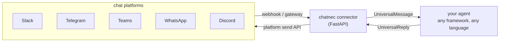

<p align="center">
  
</p>

<p align="center">
  One normalized message format. Adapters for Slack, Telegram, Teams, WhatsApp, and Discord.<br>
  A single function signature so any agent — any framework, any language — can be wired up in a few lines.
</p>

<p align="center">
  
  
  
  
</p>

---

## Contents

- [Why](#why)
- [How it works](#how-it-works)
- [Demo](#demo)
- [Quickstart — scaffold a project](#quickstart--scaffold-a-project)
- [Quickstart — Python, embedded](#quickstart--python-embedded)
- [Quickstart — any language, HTTP mode](#quickstart--any-language-http-mode)
- [Platform support](#platform-support)
- [Framework examples](#framework-examples)
- [CLI coding agents](#cli-coding-agents-claude-code-github-copilot-cli-codex-cli)
- [Security](#security)
- [Production](#production)
- [Layout](#layout)
- [Adding a new platform](#adding-a-new-platform)
- [Tests](#tests)

## Why

Every chat platform has its own webhook shape, auth scheme, and reply API —
Slack signs requests with HMAC, Telegram uses a bot-API secret token, Teams
signs with a Bot Framework JWT you validate against a JWKS endpoint, Discord
doesn't have inbound webhooks for messages at all (it's a persistent Gateway
connection). An agent that wants to run on all of them either reimplements
this five times or gets coupled to one platform's SDK.

chatnec absorbs all of that behind one interface:

- **`UniversalMessage`** — what every adapter normalizes inbound events into.
- **`UniversalReply`** — what you send back; the right adapter delivers it.
- **`AgentHandler`** — the one function signature your agent needs to implement:
  `async (UniversalMessage) -> str | UniversalReply | None`.

## How it works



Two ways to plug an agent in:

| | Embedded | HTTP |
|---|---|---|
| Where it runs | Same process as the connector | Anywhere — any language, any host |
| Wiring | `create_app(handler=my_handler)` | `AGENT_MODE=http`, `AGENT_WEBHOOK_URL=...` |
| Contract | `async (UniversalMessage) -> str \| UniversalReply \| None` | POST body is `UniversalMessage` JSON, response is `{"text": "..."}` |
| Best for | Python agents, fastest setup | Node/Go/Java/etc. agents, or independent scaling |

The HTTP contract is deliberately the smallest possible surface, one JSON
request in and one JSON response out, so it never presupposes a framework.
The [TypeScript SDK](ts-sdk/) is a thin convenience wrapper around that same
contract for Node.

## Demo

[`docs/demo.md`](docs/demo.md) has a real captured terminal transcript of the
full webhook → agent → reply round trip running locally — including
per-conversation context persisting across turns — plus the test suite
passing. It uses a stand-in platform adapter so it's reproducible without
registering real bot credentials first; the code path exercised is identical
to the one the real platform adapters run.

## Quickstart — scaffold a project

```bash
pip install chatnec
chatnec init my-agent
cd my-agent
cp .env.example .env   # fill in credentials for the platform(s) you're using
uvicorn app:app --reload
```

`chatnec init` writes a starter `app.py` (an echo agent wired to every platform
you configure) plus an `.env.example` and `.gitignore` — edit one function to
call your real agent.

## Quickstart — Python, embedded

```bash
cd python
pip install -e .
cp env.example .env   # fill in TELEGRAM_BOT_TOKEN and/or SLACK_*/TEAMS_*/WHATSAPP_*/DISCORD_*
```

```python
# any callable becomes a bot on every configured platform
from chatnec import create_app
from chatnec.integrations import from_function

def my_agent(text: str) -> str:
    return f"You said: {text}"

app = create_app(handler=from_function(my_agent))
```

```bash
uvicorn examples.embedded_mode:app --reload
```

Point the platform's webhook at `https://<your-host>/webhook/<platform>`
(`slack`, `telegram`, `teams`, or `whatsapp` — Discord connects itself, see
below) — see the comments in [`python/env.example`](python/env.example) for
per-platform setup notes.

## Quickstart — any language, HTTP mode

Run the connector standalone:

```bash
AGENT_MODE=http AGENT_WEBHOOK_URL=http://localhost:9000/agent \
  uvicorn examples.standalone_service:app --reload
```

Your agent, in whatever language or framework you like, just needs to answer
POSTs with `{"text": "..."}`. For Node.js, the TS SDK does this for you:

```ts
import { createAgentServer } from "@chatnec/sdk";

createAgentServer(async (message) => {
  return `You said: ${message.text}`; // swap in LangChain.js, Vercel AI SDK, etc.
}, { port: 9000 });
```

## Platform support

| Platform | Auth | Inbound | Notes |
|---|---|---|---|
| Slack | Bot token + signing secret | Webhook, HMAC-SHA256 signature (**required**) | Handles the `url_verification` handshake automatically |
| Telegram | Bot token | Webhook, optional secret token | Includes a `register_webhook()` helper |
| Teams (bot) | Bot Framework app ID/password | Webhook, Bot Framework JWT validated against JWKS | A separate bot identity, added to a chat/channel; OAuth2 client-credentials token cached for outbound sends |
| Teams (as you) | Delegated Microsoft Graph (device-code login) | Polling (`GET .../messages/delta`) | Acts as your own signed-in identity instead of a bot — see [below](#teams-bot-vs-teams-acting-as-you); `pip install chatnec[teams-user]`, then `chatnec teams-login` once |
| WhatsApp | Meta Cloud API access token | Webhook, HMAC-SHA256 signature (**required**) + GET handshake | `pip install chatnec` (no extra needed) |
| Discord | Bot token | Gateway (persistent connection, not a webhook) | `pip install chatnec[discord]`; requires the Message Content privileged intent |

**Slack and WhatsApp fail closed**: if `SLACK_SIGNING_SECRET` / `WHATSAPP_APP_SECRET`
isn't set, that adapter's webhook rejects every request rather than silently
accepting unverified traffic — a webhook driving your agent (and outbound
sends using your bot's real credentials) must never be trusted without a
working signature check. Telegram's secret token is genuinely optional
because Telegram itself doesn't offer per-request signing — the token is a
shared secret you choose and paste into both Telegram's `setWebhook` call and
your `.env`.

All outbound sends retry on 429/5xx with exponential backoff (honoring
`Retry-After`) — see [`chatnec/retry.py`](python/chatnec/retry.py).

## Teams: bot vs. Teams acting as you

Teams has two genuinely different integration models, both available under
different platform names:

- **`teams`** (`TeamsAdapter`) — a separate bot identity via Azure Bot
  Service. Someone has to add the bot to a chat or channel; it can only see
  and send messages there, and every message it sends is visibly from "the
  bot," not from you.
- **`teams_user`** (`TeamsUserAdapter`) — acts as *your own* signed-in Teams
  identity via delegated Microsoft Graph permissions (`Chat.ReadWrite`).
  Messages it sends look exactly like you sent them, and it can read/reply in
  any 1:1 or group chat you're already part of — no bot to add anywhere.

Setup for `teams_user`:

1. Register an Azure AD app (Azure Portal → App registrations → New
   registration). Public client, no client secret needed. Add the
   `Chat.ReadWrite` and `User.Read` delegated Microsoft Graph permissions.
   Under Authentication, enable "Allow public client flows."
2. `pip install chatnec[teams-user]`
3. Set `TEAMS_USER_CLIENT_ID` (the app registration's Application ID) in
   `.env`, and `TEAMS_USER_TENANT_ID` if you're not using a personal/`common`
   account.
4. Run `chatnec teams-login` once — it prints a URL and a short code, you sign
   in with it in a browser, and the resulting token (including a refresh
   token) is cached at `~/.chatnec/msgraph_token_cache.json`. Treat that file
   like a credential: it's what lets the connector act as you without asking
   again.
5. Start the connector as usual. `TeamsUserAdapter` polls
   `/me/chats/{id}/messages/delta` every `TEAMS_USER_POLL_INTERVAL_SECONDS`
   (default 15s) for new messages across all your chats, and ignores messages
   you sent yourself to avoid loops.

`Chat.ReadWrite` may require admin consent depending on your organization's
tenant policies — if sign-in fails with a consent-related error, that's
usually the org's Azure AD admin needing to approve the app registration's
permissions once.

## Framework examples

Same five-line pattern for any framework — call it, return text:

- [LangChain](python/examples/langchain_agent.py) / [`from_langchain_runnable`](python/chatnec/integrations/langchain.py)
- [CrewAI](python/examples/crewai_agent.py)
- [AutoGen](python/examples/autogen_agent.py)
- [OpenAI Assistants](python/examples/openai_assistants_agent.py)

## CLI coding agents (Claude Code, GitHub Copilot CLI, Codex CLI)

Claude Code, GitHub Copilot CLI, Codex CLI, and similar tools aren't
importable Python objects — you run them as a subprocess with a prompt and
read the reply from stdout. [`from_cli_agent`](python/chatnec/integrations/cli_agent.py)
wraps that shape: you supply a `command(text, context) -> argv` function to
build the command line for one turn, and an `output_parser(output, context) -> str`
that can stash a session/resume ID in `context` — chatnec's per-conversation
state — so a chat thread continues the same CLI session turn to turn instead
of starting fresh each message.

- [Claude Code](python/examples/claude_code_agent.py) — uses `claude -p
  --output-format json` and `--resume <session_id>`
- [GitHub Copilot CLI](python/examples/github_copilot_cli_agent.py) — the
  standalone `copilot` agent (`gh copilot` now delegates to the same binary
  on recent `gh` versions). Generates its own session UUID for `--resume`
  rather than parsing it out of output — see the docs below for why.
- [Codex CLI](python/examples/codex_cli_agent.py) — uses `codex exec --json`
  and `codex exec resume <thread_id> --json`, scanning the JSONL event
  stream for the `thread_id` and the final `agent_message` text.
- Plain **GitHub Copilot** (the IDE chat panel) and plain **GitHub CLI**
  (`gh`) don't have a non-interactive "prompt in, reply out" entrypoint of
  their own to wire up this way — Copilot CLI above is the automatable
  Copilot surface, and `gh` is a tool the agents above can shell out to
  themselves, not a separate agent to integrate.
- The same pattern covers any other prompt-in/text-out coding agent — swap
  the argv and output parsing.

**[docs/cli-agents.md](docs/cli-agents.md)** has full setup for all three
(install, auth, a standalone sanity-check command before wiring it in,
troubleshooting) — every command and flag on that page was checked against a
real install while writing it, including exact error messages you might hit
(e.g. an org policy block on Copilot CLI).

**This is a meaningfully bigger blast radius than a normal agent reply**: a
chat message becomes a trigger for code execution on whatever machine runs
the connector. Scope the working directory to a repo you're comfortable an
external chat message could affect, restrict who can reach the webhook, and
prefer a low-privilege container/VM over your main machine — see the module
docstring in `cli_agent.py` and the [Security](#security) section below.

## Security

Every inbound webhook drives your agent and can trigger an outbound send using
your bot's real credentials, so verification failing closed (rejecting when
misconfigured, rather than silently accepting) is the default posture:

- **Slack / WhatsApp**: webhook signature verification is mandatory. If
  `SLACK_SIGNING_SECRET` / `WHATSAPP_APP_SECRET` isn't set, that platform's
  webhook rejects every request rather than accepting unverified traffic — you
  won't get a silently-open endpoint from a forgotten env var.
- **Teams (bot)**: JWT validation against the Bot Framework's JWKS is on by
  default (`verify_jwt=True`); turn it off only for local testing against the
  Bot Framework Emulator.
- **Teams (as you)**: the device-code login cache
  (`~/.chatnec/msgraph_token_cache.json` by default) contains a live refresh
  token scoped to your account — it's stored outside the repo by default and
  is never logged, but treat it like any other credential file (file
  permissions, backups, etc. are on you, same as any OAuth token cache).
- **`POST /reply`** (for agents pushing replies back asynchronously) requires
  `REPLY_API_KEY` to be set — the endpoint returns `503` until it is, rather
  than accepting unauthenticated requests that could send arbitrary messages
  as your bot.
- **CLI coding agents** (`from_cli_agent` — Claude Code, Copilot CLI, etc.)
  are a different risk category from the rest of chatnec: a verified webhook
  only proves the message came from the real platform, not that whoever sent
  it should be allowed to trigger code execution on your machine. If you wire
  one of these up, add your own authorization check (e.g. only act on
  messages from specific `user_id`s) before invoking the CLI agent — chatnec
  doesn't do this for you, since it doesn't know your intended trust model.

If you find a security issue, please open an issue rather than a public PR
with exploit details.

## Production

- **Docker**: `docker build -t chatnec python/` or `docker compose up` (starts
  the connector + Redis — see [`docker-compose.yml`](docker-compose.yml))
- **Session state**: in-memory by default; set `REDIS_URL` to switch to
  `RedisSessionStore` so conversation state survives restarts and is shared
  across processes (`pip install chatnec[redis]`)
- **Metrics**: `GET /metrics` in Prometheus text format — messages received,
  replies sent, and agent errors, labeled by platform
- **Logging**: structured JSON to stdout by default (`LOG_FORMAT=text` for
  plain-text logs; `LOG_LEVEL` to adjust verbosity)
- **CI**: [`.github/workflows/ci.yml`](.github/workflows/ci.yml) runs the
  Python test suite, builds the TS SDK, and builds the Docker image on every
  push/PR

## Layout

```
python/chatnec/
  models.py            UniversalMessage, UniversalReply, AgentHandler
  adapters/             slack.py, telegram.py, teams.py, teams_user.py, whatsapp.py, discord.py, base.py (add new platforms here)
  agent_connector.py    embedded vs HTTP dispatch to your agent
  server.py             FastAPI app: /webhook/{platform}, /reply, /health, /metrics
  integrations/         from_function (generic), from_cli_agent (Claude Code/Copilot CLI/Codex CLI/etc.), from_langchain_runnable (example)
  session.py            per-conversation state (in-memory or Redis)
  retry.py              backoff for outbound platform API calls
  metrics.py            Prometheus-format counters
  logging_config.py     structured JSON logging
  msgraph_auth.py        MSAL device-code login for Teams-as-you (and future delegated-Graph adapters)
  cli.py                `chatnec init` project scaffolding, `chatnec teams-login`
ts-sdk/src/              createAgentServer + ChatConnectorClient for Node agents
```

## Adding a new platform

Subclass `chatnec.adapters.base.PlatformAdapter` and implement `parse_webhook`
and `send_message`; register it in `_build_adapters_from_settings()` in
`server.py` (or just pass `adapters={...}` to `create_app()` directly). For a
platform with no inbound webhook (like Discord), set `is_push_adapter = True`
and implement `start_listening()` instead. See
[`docs/architecture.md`](docs/architecture.md) for the full message flow and
design rationale.

## Tests

```bash
cd python && pytest
```

## License

[MIT](LICENSE)
